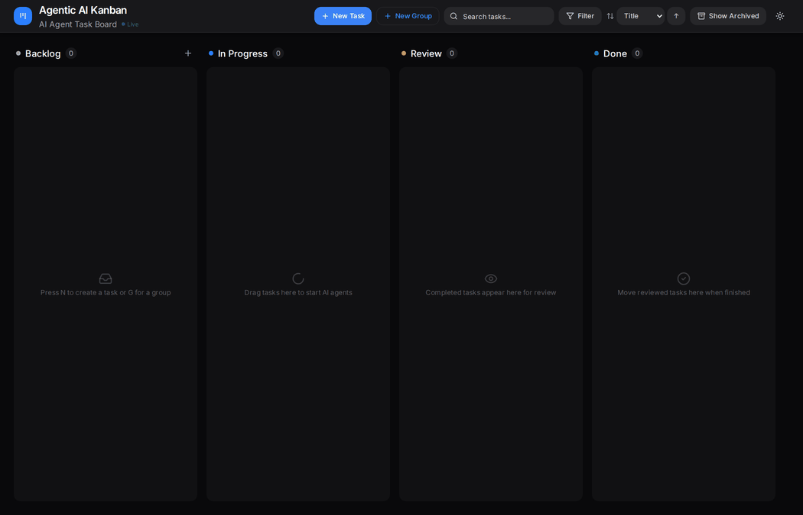

<p align="center">
  
</p>

<p align="center">
  <a href="#quick-start">Quick start</a> •
  <a href="#how-it-works">How it works</a> •
  <a href="#documentation">Documentation</a> •
  <a href="#contributing">Contributing</a>
</p>

# Infinite Kanban

**A Kanban board where AI coding agents do the work.** Create a task, assign it to a worker, and start it: an agent plans, edits code, and runs commands in your repository while its progress streams live onto the card. When it finishes, the task lands in Review with a branch you can merge or turn into a pull request.



## Key features

- **Agents on the board.** Run OpenCode agents per task and watch thinking, tool calls, file edits, and command output live in a terminal-style panel.
- **Workers on your machines.** A lightweight worker runs tasks where your repositories and agent credentials live; the board only coordinates.
- **Human in the loop.** Send follow-up messages to a running agent and answer its clarifying questions; tasks waiting on you sit in a dedicated **Pending** column.
- **Safe git workflow.** Optional per-task branches in git worktrees, one-click local merge or PR creation, and automatic worktree cleanup.
- **Task groups.** Launch 2–20 related tasks at once with a parallelism limit and track them as one card.
- **Integrations.** An idempotent orchestration API for chat assistants and automation, plus scheduled import of your assigned Jira issues.
- **Everyday board tools.** Projects, templates, priorities, labels, filters and search, archiving, keyboard shortcuts, and dark/light themes.
- **Simple storage.** SQLite with zero configuration, or PostgreSQL for shared deployments.

## How it works

1. **Create a task** in Backlog, or import it from Jira or the orchestration API.
2. **Assign a worker and start it.** The task moves to **In Progress** and the worker's agent begins, streaming events to the board.
3. **Steer if needed.** Send follow-up messages, and answer the agent's clarifying questions from the task panel.
4. **Review.** Completed work moves to **Review** with the agent's output and changes.
5. **Ship.** Merge the branch locally or create a PR, then move the card to **Done**.

## Supported agents

| Agent | Status |
|-------|--------|
| [OpenCode](https://opencode.ai) | Supported. Workers drive OpenCode through its server API or the `@codewithdan/agent-sdk-core` provider. |

Earlier versions supported GitHub Copilot, Claude Code, Codex, Hermes, and OpenClaw directly. Tasks created with those agent types are now run with OpenCode, which can itself use models from many providers (for example GitHub Copilot).

## Prerequisites

- Node.js 22+ and npm 10+
- Git
- For each worker machine: the [OpenCode CLI](https://opencode.ai) installed and authenticated with a model provider
- Optional: Docker, for PostgreSQL or the containerized deployment

Works on Linux, macOS, and Windows.

## Quick start

```bash
git clone https://github.com/SaltyRucula/infinite_kanban.git
cd infinite_kanban
npm install
npm run dev
```

This starts the API server on [http://127.0.0.1:8080](http://127.0.0.1:8080) and the board on [http://localhost:8081](http://localhost:8081), using a local SQLite database.

Then register a worker so tasks can run (from a second terminal, on the machine that has your repositories):

```bash
npm run worker:build
node packages/worker/dist/cli.js register --serverUrl http://localhost:8080 --workspacePath ~/Development --agentTypes opencode
node packages/worker/dist/cli.js run
```

With no `API_KEY` configured the registration token isn't checked, so enter any value when prompted. Full details: [Workers](docs/workers.md).

## Basic configuration

The server reads `packages/server/.env`; copy [`packages/server/.env.example`](packages/server/.env.example) to start. The settings most people touch:

| Variable | Default | Purpose |
|----------|---------|---------|
| `DATABASE_URL` | _(unset: SQLite)_ | PostgreSQL connection string |
| `API_KEY` / `VITE_API_KEY` | _(unset: open access)_ | Bearer token for the API and WebSocket; both must match |
| `HOST` / `PORT` | `127.0.0.1` / `8080` | Server bind address and port |
| `ALLOWED_REPO_ROOTS` | home, temp, workspace | Directories agents may work in |

Every variable is documented in [Configuration](docs/configuration.md).

## Development and testing

```bash
npm run dev:server        # API only (8080)
npm run dev:client        # board only (8081)
npm run gate:required     # required before push: client build, server build, E2E
npm run hooks:install     # enable the pre-push gate for this clone
```

More in [Development](docs/development.md).

## Documentation

| Guide | Covers |
|-------|--------|
| [Configuration](docs/configuration.md) | All environment variables, service-token scopes |
| [Workers](docs/workers.md) | Registering and running workers, runner profiles, Docker worker |
| [Deployment](docs/deployment.md) | systemd + nginx + Cloudflare, Docker Compose, macOS launchd, security checklist |
| [Integrations](docs/integrations.md) | Orchestration API, Hermes plugin, Jira import and scheduling |
| [Development](docs/development.md) | Local workflow, tests, required gate |
| [Architecture](docs/architecture.md) | Components, task lifecycle, execution paths, events and retention |

## Contributing

Contributions are welcome. See [CONTRIBUTING.md](CONTRIBUTING.md) for the workflow and [SECURITY.md](SECURITY.md) for reporting vulnerabilities.
